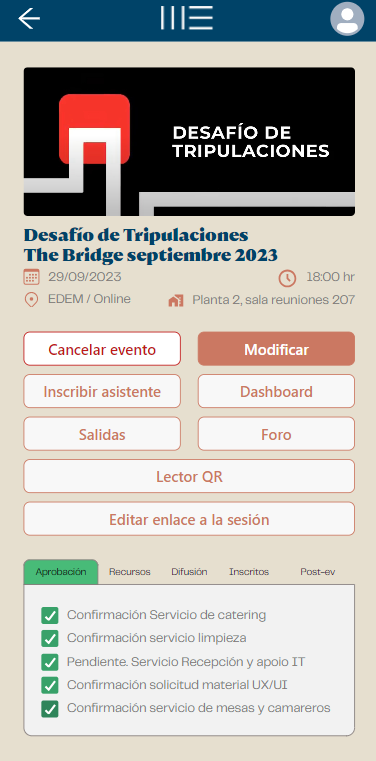
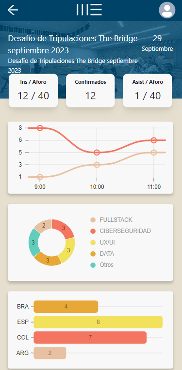
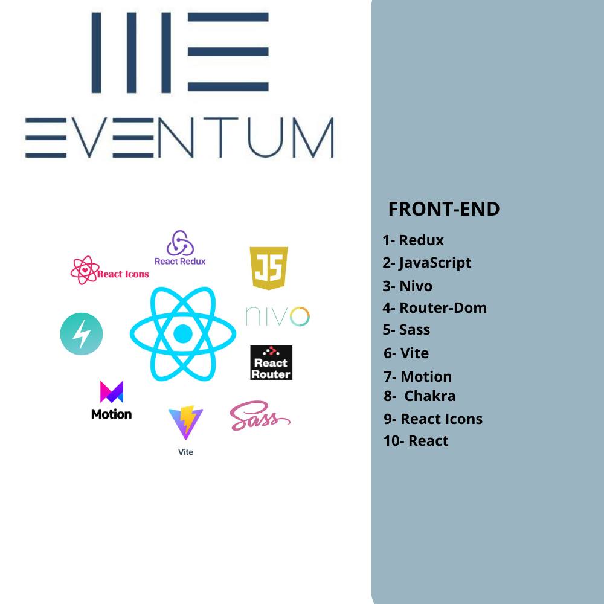
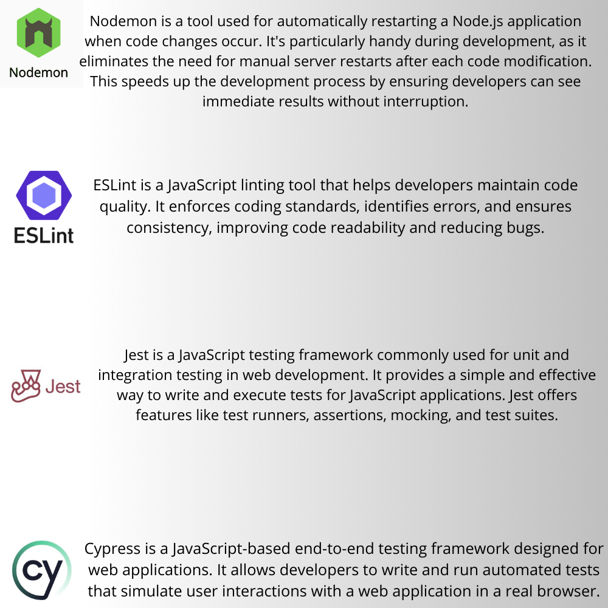
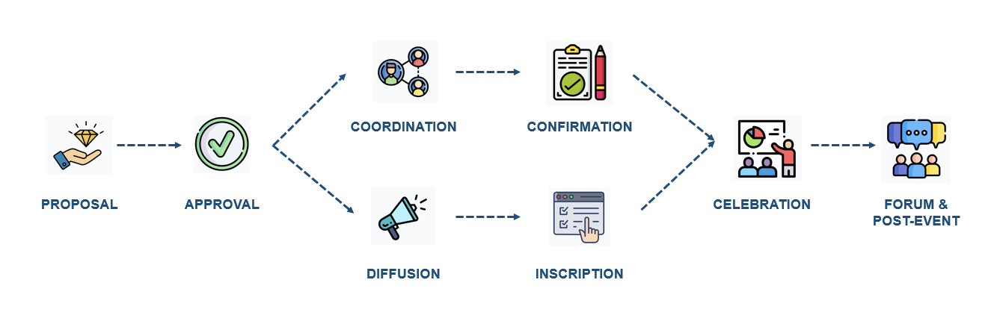

  <h1 align="center" id="top">Eventum - Front end</h1>


Eventum is an application designed to optimize and automate the process of creating, managing, and confirming events at **Marina de Empresas**. Its main purpose is to improve operational efficiency and provide a more convenient user experience for participants who wish to attend our events.
At Marina de Empresas, we are committed to delivering outstanding event experiences. Eventum is a testament to our dedication to operational excellence and creating a user-centric approach to event management.


## User Benefits


- Improved Accessibility: Participants have easy access to event information, reducing friction in the registration process.

- Engaging Experiences: Attendees benefit from interactive event features, fostering engagement and networking opportunities.

- Data-Driven Decisions: Data analytics empower organizers to refine event strategies, ensuring they meet participant expectations.

- Enhanced Efficiency: Organizers can save time and resources by automating administrative tasks, allowing them to focus on creating memorable events. 

- We have implemented qrcode in our project to generate QR codes easily and quickly. qrcode is a Node.js library that allows creating QR codes in various output formats, such as PNG or SVG, as well as directly in the console.

- **Admin area**: We have implemented a real-time dashboard that updates as clients arrive. This dynamic dashboard provides up-to-the-minute information and automatically adjusts as new clients join the system.


   </img>
  


## Index
1. [Structure](#structure)
2. [Installation](#installation)
3. [Usage](#usage)
4. [Configuration](#configuration)
5. [Status](#status)
6. [Flow](#flow)
7. [FAQ](#faq)
8. [Relevant Links](#relevant-links)
9. [Credits](#Credits)
10. [Contribution](#contribution)
11. [ Development made by](#Developmentmadeby)


## 1. Structure
The choice to structure our project using the Model-View-Controller (MVC) pattern is based on the pursuit of an efficient and visually organized approach for our application. MVC divides the application into three core components: the Model, responsible for data management and business logic; the View, handling visual representation and the user interface; and the Controller, managing control logic and user interaction. This separation of responsibilities not only simplifies collaborative development but also enhances maintainability by enabling developers to work on specific parts of the project without affecting the whole. Furthermore, it facilitates code reuse, potentially speeding up development, and ensures that the application is scalable and adaptable as it evolves, resulting in a more robust and visually appealing final product. Ultimately, the choice of MVC contributes to a more efficient and successful development experience for our project.


 </img> |||  </img>

## 2 - Installation


### Front-end dependencies

These are the front-end dependencies used in the project, along with brief explanations of their roles and how to install them.

**React**

React is a widely adopted and extensively used JavaScript library in the web development world. React simplifies the creation of user interfaces by offering a structured and efficient way to build interactive web applications. It focuses on building reusable UI components that efficiently update and render when data changes. React is known for its performance, developer-friendly tools, and the ability to create single-page applications (SPAs).

```
npm install react
``` 

**Redux**

Redux is a predictable state management library commonly used in JavaScript applications, particularly with frameworks like React. It helps manage the state of your application in a predictable and efficient way, making it easier to develop complex user interfaces and handle data flow.

```
npm @reduxjs/toolkit
``` 


**Vite**

Vite is a build tool and development server that is designed to make modern web development faster and more efficient. It is often used for building JavaScript and TypeScript-based web applications, particularly with frameworks like Vue.js and React.

```
npm install vite
```

**Chakra-ui/react**

@Chakra-ui/react is a popular and highly customizable component library for building user interfaces in React. It is designed to make it easy for developers to create beautiful and accessible UIs while maintaining flexibility and extensibility.

```
npm install @chakra-ui/react
```
**Emotion/react**

@emotion/react is the core package of the Emotion library. It provides the foundational building blocks for defining and managing styles within your React components. It allows you to write CSS styles directly within your JavaScript or TypeScript code.

```
npm install @emotion/react
```
**Emotion/styled**

@emotion/styled is an extension of @emotion/react that provides a more convenient and expressive way to create styled components. It simplifies the process of defining and applying styles to your components.

```
npm install @emotion/styled
```

**Nivo Chart Libraries**

Nivo is a collection of powerful data visualization libraries for React that simplifies the process of creating interactive and aesthetically pleasing charts and graphs. These libraries are designed to help developers quickly and effectively present data in various visual formats. Here's a brief overview of each library.

```
npm install @nivo/bar @nivo/bump @nivo/line @nivo/pie
```

**Axios**

Axios is a popular JavaScript library that simplifies the process of making HTTP requests from web browsers or Node.js applications. It provides a clean and straightforward API for sending HTTP requests and handling responses. Axios is commonly used in web development for tasks like fetching data from a server, sending data to a server, or interacting with APIs.

```
npm install axios
```

**Framer Motion**

Framer Motion is a popular animation library for React applications that simplifies the process of adding smooth and interactive animations to your user interfaces. It's designed to work seamlessly with React, making it a powerful tool for creating engaging and visually appealing web and mobile applications. Here are some key features and concepts related to Framer Motion.

```
npm install framer-motion
```

**html2canvas**

html2canvas is a JavaScript library that allows you to capture or "screenshot" a portion or the entirety of an HTML document, including its CSS-styled content, as a static image. This library is useful for various scenarios where you want to generate an image representation of a web page or a specific element within a page, such as creating previews, sharing content on social media, or generating PDFs.

```
npm install html2canvas
```

**jsPDF**

jsPDF is a widely-used JavaScript library for generating PDF documents on the client-side. It allows you to create, modify, and save PDF files directly from your web browser, making it a versatile tool for generating reports, invoices, forms, and other PDF-based content within web applications. Here are some key features and concepts related to jsPDF.

```
npm install jspdf
```


**qrcode**

qrcode is a JavaScript library that allows you to generate QR codes (Quick Response codes) on the client-side. QR codes are two-dimensional barcodes that can store various types of data, including URLs, text, contact information, and more. They are widely used for mobile payments, ticketing, marketing, and various other applications where quick and easy access to information is important.

```
npm install qrcode
```


**html5-qrcode**

html5-qrcode is a JavaScript library that simplifies the process of working with QR code scanning in web applications. It provides an easy way to integrate QR code scanning functionality into your web application, allowing users to use their device's camera to scan QR codes and extract information from them.

```
npm install html5-qrcode
```

**react-datetime**

react-datetime is a JavaScript library for rendering and managing date and time inputs in React applications. It provides a set of highly customizable and user-friendly date and time pickers that can be easily integrated into your web forms and user interfaces. Here are some key features and concepts related to react-datetime.

```
npm install react-datetime
```


**react-dom**

react-dom is a package in the React ecosystem that provides the necessary tools and methods for rendering React components in web applications. It specifically focuses on rendering React components into the Document Object Model (DOM) of a web page. Here are some key features and concepts related to react-dom.

```
npm install react-dom

```

**react-router-dom**

react-router-dom is a popular JavaScript library for adding client-side routing and navigation to React applications. It allows you to create single-page applications (SPAs) with multiple views and navigation between them without the need for full-page reloads. Here are some key features and concepts related to react-router-dom.

```
npm install react-router-dom

```

**react-icons**

react-icons is a popular library for easily including a wide variety of icons in React applications. It provides a collection of high-quality, customizable icon sets that you can use to enhance the user interface and user experience of your web or mobile applications. Here are some key features and concepts related to react-icons.

```
npm install react-icons
```

**react-use-websocket**

react-use-websocket is a library for managing WebSocket connections in React applications. WebSocket is a communication protocol that enables two-way communication between a client (typically a web browser) and a server over a single, long-lived connection. This library simplifies the process of integrating WebSocket functionality into your React components. Here are some key features and concepts related to react-use-websocket.

```
npm install react-use-websocket
```

**Sass - (Syntactically Awesome Stylesheets)**

Sass is a CSS preprocessor that extends the capabilities of regular CSS. It adds features and functionality that make it easier to write and maintain stylesheets for web development. Sass is widely used in web development projects to improve the efficiency and organization of CSS code. Here are some key features and concepts related to Sass. 

```
npm install sass
```

<div align="right">
  <a href="#top">↑ Back to the top</a>
</div>

<h1>

   </img>
  
</h1>

### 2.3 .Development Dependencies

Below is a list of development dependencies used in this project along with a brief explanation of their functionality.


```
npm install nodemon -D
npm install eslint 
npm install jest 
npm install cypress

```

<h1>

   </img>
  
</h1>

<div align="right">
  <a href="#top">↑ Back to the top</a>
</div>

## 3. Usage

Once you have installed the main and secondary dependencies in your project, you can start using the Eventum Front end. Here are the basic steps for using it:

### 3.1. Start the Server

```
npm start
```

This command will start the server and get it up and running. Make sure the server is running before making any requests.

If you need more information about the API **(Back-end)**, feel free to visit our [Postman documentation](https://grey-meadow-86508.postman.co/workspace/poppaBack~40055b61-3f05-4b79-852e-054c752905f0/collection/28231572-60a28a80-ae6a-46a1-a63b-db457685977e?action=share&creator=28231572&active-environment=28231572-0744ac4e-249a-4509-8a21-792b6de4c867).

<div align="right">
  <a href="#top">↑ Back to the top</a>
</div>

## 4. Configuration

#### 1 -Create a new React project: Use Create React App or set up manually.
#### 2-Install Redux dependencies: Run npm install redux react-redux redux-thunk.
#### 3-Configure the Redux Store: Create a store to manage global state.
#### 4-Create Reducers: Define reducers to update state with actions.
#### 5-Create Actions: Design actions to dispatch events that modify state.
#### 6-Connect components: Utilize the connect function to link components to the Redux store.
#### 7-Define Routes: Set up routes using react-router-dom for navigation.
#### 8-Style components: Apply styling using CSS or libraries like Styled Components.
#### 9-Develop components: Build reusable React components.
#### 10-Test and Deploy: Write tests, build for production, and deploy to a hosting server or platform.


### 4.1 Credentials

The project must have an .env file, which will contain all the environment variables used for both database connection and project deployment configuration. Among our files, you will find an example.env file that you can use as a template to input your own data if you wish to continue the development of this project.

<div align="right">
  <a href="#top">↑ Back to the top</a>
</div>

## 5. Status

#### Scrum Methodology

1. **Agile Approach:** We embrace an agile approach to project management.
2. **Scrum Methodology:** Specifically, we follow the Scrum methodology.
3. **Iterative Development:** Scrum involves iterative development cycles known as "sprints."
4. **Cross-Functional Teams:** We form cross-functional teams to tackle tasks.
5. **Product Backlog:** We maintain a prioritized product backlog of work items.
6. **Sprint Planning:** Before each sprint, we conduct sprint planning meetings to select tasks.
7. **Daily Standups:** We hold daily standup meetings for team coordination.
8. **Review and Retrospective:** At the end of each sprint, we review the work done and hold a retrospective to improve processes.
9. **Adaptation:** Scrum encourages adaptation based on feedback, allowing for flexibility.
10. **Continuous Improvement:** Our focus is on delivering value incrementally and continuously improving our processes.

## 6. Flow 

<h1>

   </img>
  
</h1>


<div align="right">
  <a href="#top">↑ Back to the top</a>
</div>

## 7. FAQ

## Frequently Asked Questions (Front End)

### How do I start the front-end development server?

To start the front-end development server, run the command `npm start` in your project's root directory. Ensure that you have installed the necessary dependencies with `npm install` beforehand.

### Where can I configure front-end settings?

Front-end configuration settings, such as API endpoints or environment variables, can be managed in the `.env` file located in the project's root directory. You can use the example.env file as a reference.

### How do I access the Redux DevTools during development?

You can access the Redux DevTools by installing the Redux DevTools browser extension for Chrome or Firefox. Once installed, you can use it to inspect and debug the Redux state and actions.

### What should I do if I encounter errors or bugs in the front-end?

If you encounter errors or bugs in the front-end, check the browser console for error messages. Review your code, ensure Redux actions and reducers are correctly configured, and verify that API requests are functioning as expected.

### How can I customize the user interface (UI) and components?

To customize the UI and React components, you can edit the source code located in the `src` directory. Modify or create new React components, update styles, and manage state with Redux as needed to tailor the application to your requirements.

### How do I handle routing in my React application?

For routing in your React application, you can use the `react-router-dom` library. Define routes in your application using `BrowserRouter` and `Route` components. Check the official documentation for detailed guidance on setting up routes.

### Where can I find additional resources for React and Redux?

To expand your knowledge of React and Redux, explore the official documentation and tutorials available on the following websites:
- [React Official Documentation](https://reactjs.org/docs/getting-started.html)
- [Redux Official Documentation](https://redux.js.org/)
- [React-Redux Official Documentation](https://react-redux.js.org/)
- [Redux Toolkit Official Documentation](https://redux-toolkit.js.org/)

### How do I optimize the performance of my React and Redux application?

Optimizing performance involves techniques like code splitting, lazy loading, and state normalization. Refer to performance optimization guides in the official documentation to enhance the speed and efficiency of your application.

### How can I get support for specific issues or questions?

If you encounter specific issues or have questions related to your React and Redux project, consider seeking help in online developer communities, forums, or by posting questions on platforms like Stack Overflow. You can also engage with the React and Redux communities on social media or consult project-specific documentation if available.

### How do I deploy my React and Redux application to a production server?

To deploy your React and Redux application to a production server, you'll need to build your app for production using `npm run build` and then configure a web server like Nginx or deploy it to a hosting platform like Netlify, Vercel, or AWS. Ensure that production configurations are correctly set in the `.env` file and the backend is configured for production use.


<div align="right">
  <a href="#top">↑ Back to the top</a>
</div>

## 8. Relevant links

#### [React Official Documentation](https://legacy.reactjs.org/docs/getting-started.html)
#### [Redux Official Documentation](https://redux.js.org/)
#### [NodeJS download](https://nodejs.org/es/download)
#### [MySQL download](https://www.mysql.com/downloads/)

<div align="right">
  <a href="#top">↑ Back to the top</a>
</div>

## 9. Credits

**Special thanks to the all Team**

## I want to express my profound gratitude to the entire development team, as well as every member of the design team, the talented data experts, and the dedicated cybersecurity professionals. Your collaboration and collective effort have made it possible for this project to become a reality in record time 🚀

--

# Data Science Overview:

-  Data Acquisition, Analysis, Visualization: acquiring, analyzing, and visualizing data.
- Application Development with Python and Django: The core of our applications is built using the Django framework.
- Data: contribution to the Database.


--

# Cybersecurity Overview:
 
- Comprehensive monitoring and analysis of security-related data.
- Pentesting: Our project involves penetration testing using tools to assess vulnerabilities.
- Code Auditing: Our code undergoes thorough audits using SonarQube to ensure code quality and security.
- Security by Design: We emphasize security from the design phase, encompassing protocols, password and port configurations, library versions, and user permissions and privileges.


--

# Overview UX/UI:


- Interface interaction and Design.
- Ideation and conceptualization: We brainstorm ideas and conceptualize user interfaces.
- Conduct user research to gain insights into user needs and preferences.
- Focus on designing interactions and interfaces that enhance user experiences.


      


<div align="right">
  <a href="#top">↑ Back to the top</a>
</div>

## 10. Contribution

We welcome contributions from the community to help improve Eventum. If you wish to contribute, please follow these guidelines:

1. **Fork the Repository**

   To get started, fork the Eventum repository to your GitHub account. This will create a copy of the project that you can freely experiment with.

2. **Clone the Repository**

   Clone your forked repository to your local development environment using the following command (replace `[your_username]` with your GitHub username):

   ```
   git clone https://github.com/[your_username]/Eventum.git
   ```

**Create a new branch**
Before making any changes, create a new branch for your contribution. This helps keep the main branch clean and allows for a focused contribution:

```
git checkout -b my-contribution
```

**Make Changes and Commit**
Make the necessary changes or additions to the codebase. Once you're satisfied with your changes, commit them using descriptive commit messages:

```
git commit -m "Add feature: [your feature description]"
```

**Push to Your Fork**
Push your changes to your forked repository on GitHub:

```
git push origin my-contribution
```

<div align="right">
  <a href="#top">↑ Back to the top</a>
</div>


## 11. FULL STACK TEAM 😁🚀

<table>
  <tr>
    <td align="center">
      <a href="https://github.com/patrigarcia">
        
      </a>
      <br>
      <a href="https://github.com/patrigarcia">Patricia Gonzalez</a>
    </td>
    <td align="center">
      <a href="https://github.com/saraoriola">
        
      </a>
      <br>
      <a href="https://github.com/saraoriola">Sara Oriola</a>
    </td>
    <td align="center">
      <a href="https://github.com/victorcodigos">
        
      </a>
      <br>
      <a href="https://github.com/victorcodigos">Victor Macedo</a>
    </td>
    <td align="center">
      <a href="https://github.com/AdrianRgGit">
        
      </a>
      <br>
      <a href="https://github.com/AdrianRgGit">Adrian Ramirez</a>
    </td>
  </tr>
</table>


